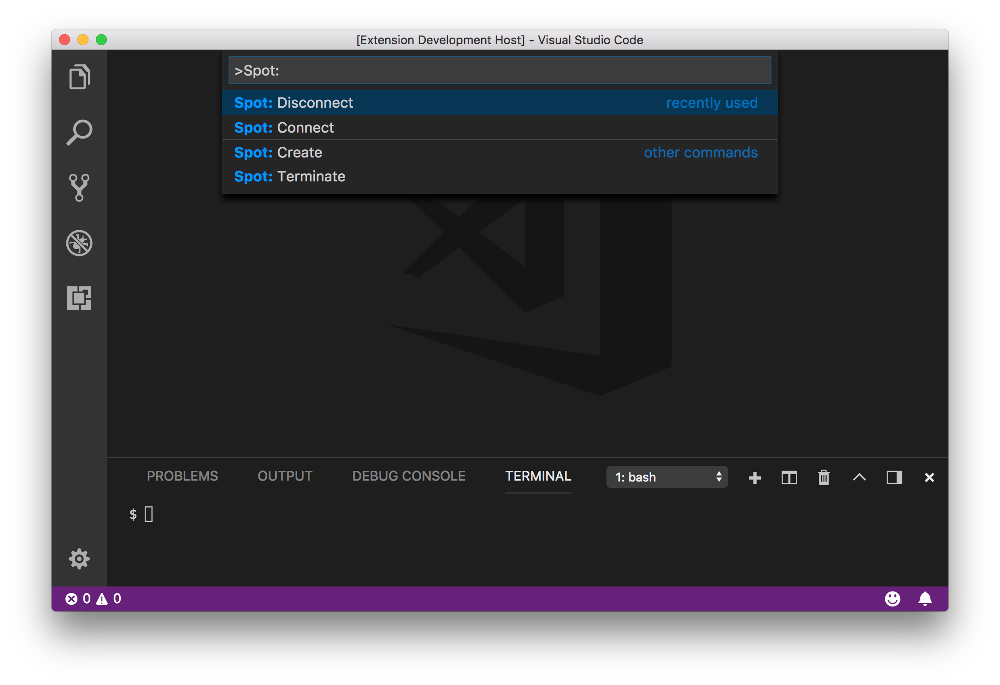
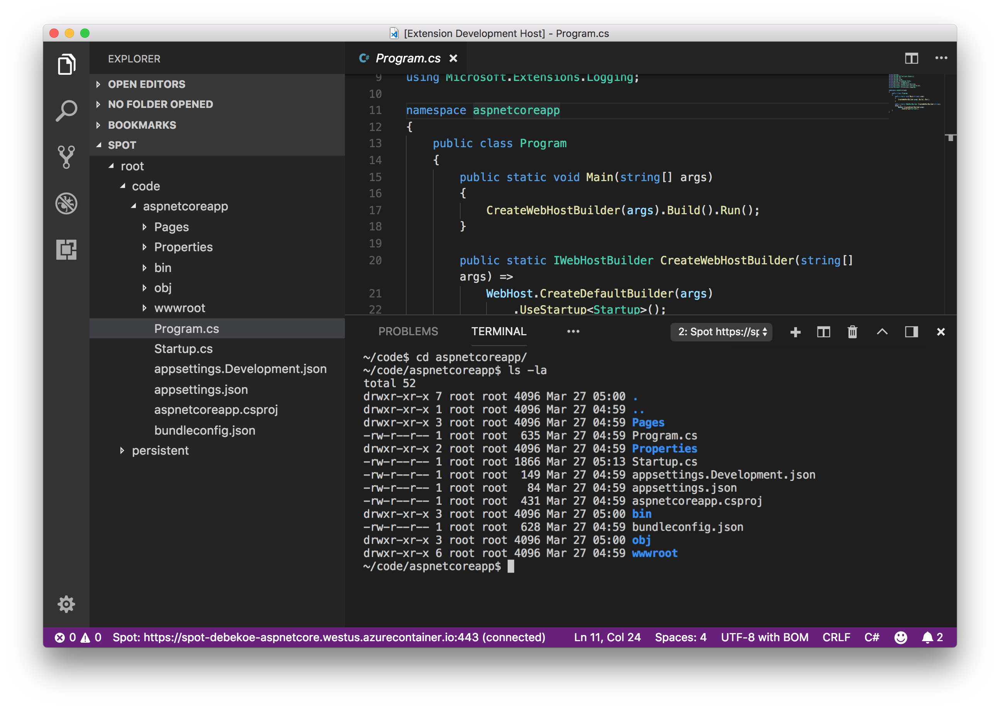
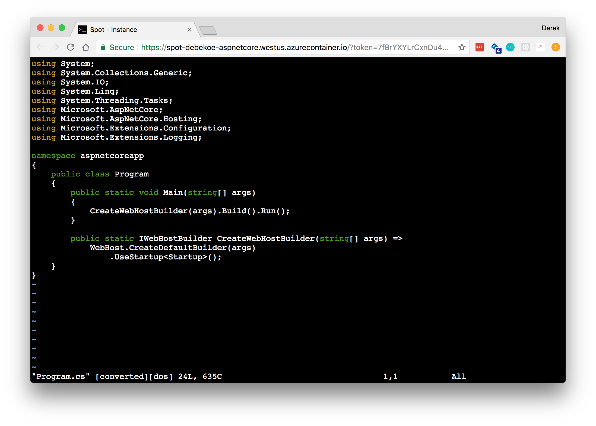

# Spot: Instant cloud environments for developers

Developer tools are becoming more cloud powered. Scaling beyond what the user’s machine can provide is an awesome opportunity to do amazing things. Spot is a VS Code extension that provides an integrated terminal, file explorer and editor to any container image with terminal access through the browser also.

- VS Code Extension
    - Terminal, File Explorer, File Editing, Notifications, Status Bar
- Persistent File Storage
- Bring your own container
- Secure access over HTTPS
- In-browser access

## Commands

| Command | Description |
| --- |---|
| `Spot: Create`     | Create a new spot.
| `Spot: Connect`    | Connect to a spot using the spot name and token.
| `Spot: Disconnect` | Disconnect from a spot but keep it running.
| `Spot: Terminate`  | Terminate a spot.

## Quickstart

A few steps to get you started right away.

1. Get the VS Code extension (vsix) from [releases](https://github.com/derekbekoe/vscode-spot/releases).
2. Install by following [VS Code extension install](https://code.visualstudio.com/docs/editor/extension-gallery#_install-from-a-vsix).
3. Set up the file share.
    - Upload `spot-host-linux-0.1.9`, ` pty.node` and `certbot_start.sh` from [GitHub releases](https://github.com/derekbekoe/vscode-spot/releases/tag/v0.1.1) to the root of an Azure storage file share. Add the details as share 1 in the ARM template in the next step.
4. Deploy [the ARM template](doc/armdeploy.json) into a resource group after modifying the variables.
    `az group deployment create --resource-group myResourceGroup --name myDeploymentName --template-file armdeploy.json`
5. Connect to the spot with `Spot: Connect`.
    - First input box, type hostname & port: e.g. `https://spotName.westus.azurecontainer.io:443`
    - Second input box, type the token you defined in the ARM template: e.g. `myToken`

When done, `Spot: Disconnect`

:exclamation: Spot utilizes [Azure Container Instances](https://azure.microsoft.com/en-us/services/container-instances/). See [Container Instances pricing](https://azure.microsoft.com/en-us/pricing/details/container-instances/) for their pricing information.

:warning: When you're done with a spot, save any files in persistent storage and **terminate** the spot.

## Feedback

* Vote for [popular feature requests](https://github.com/derekbekoe/vscode-spot/issues?q=is%3Aopen+is%3Aissue+label%3Aenhancement+sort%3Areactions-%2B1-desc).
* File a bug in [GitHub Issues](https://github.com/derekbekoe/vscode-spot/issues).
* Tweet with hashtag [#vscodespot](https://twitter.com/search?q=vscodespot) with other feedback.

## Known Limitations

- Intellisense & Debugging
    - Currently, there is no cross-file Intellisense or debugging
- Image pull time
    - Large container images can take a couple minutes to start.
- Reliability / Resilience
    - Better handling of loss of connectivity is yet to come.
- Only Linux containers are supported
    - We hope to lift this limitation in the future.

## Developer Setup

Looking to contribute or debug yourself?

1. Clone the repository
2. Open VS Code
3. Run `npm install`
4. Start the VS Code debugger to launch the extension

## Release History

See [GitHub Releases](https://github.com/derekbekoe/vscode-spot/releases).

## License
[MIT](LICENSE.md)
